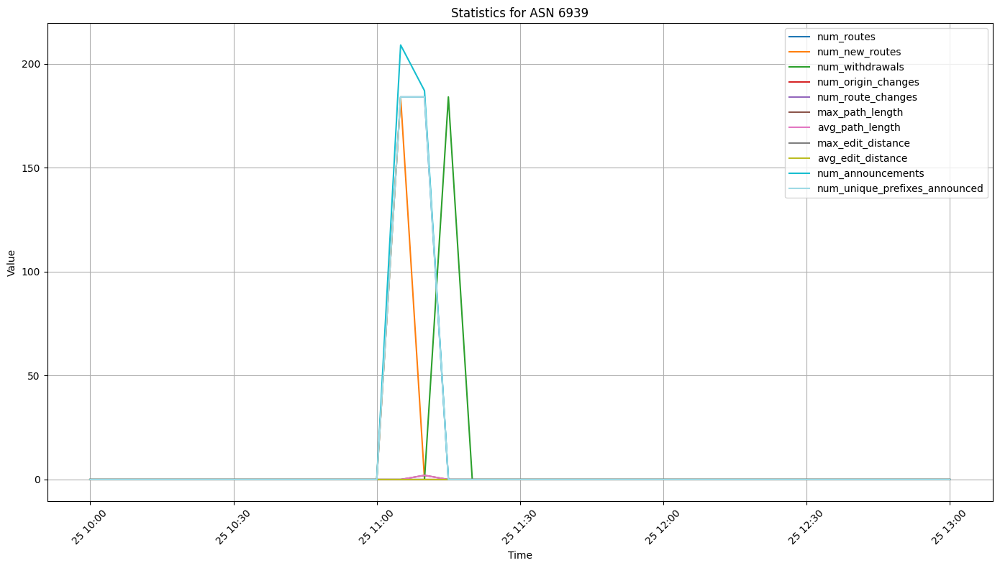
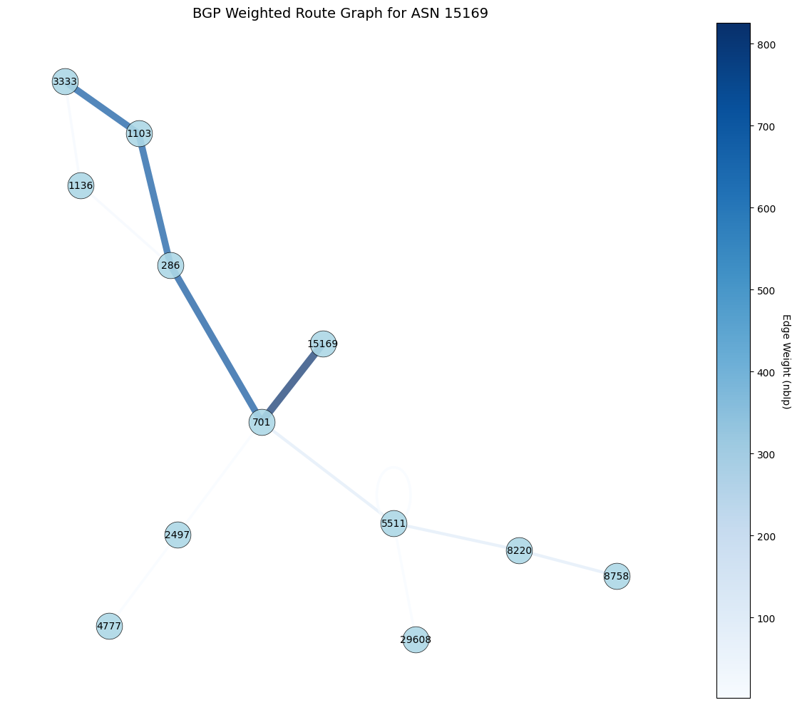

# BGP Routing Data Analysis and Feature Extraction

## Overview
This repository contains a collection of Python scripts utilizing PyBGPStream for analyzing BGP routing data, extracting relevant features, and performing graph-based analysis (e.g., AS path frequency). The scripts are designed to assist in understanding BGP routing behaviors, including updates, hijackings, and real-time analysis. Additionally, they provide tools for feature extraction and graphical analysis, allowing users to visualize and interpret the frequency of AS paths and other key metrics within the BGP data.

 **Install PyBGPStream**:
Visit [PyBGPStream Installation Guide](https://bgpstream.caida.org/docs/install/pybgpstream) for detailed installation instructions.

### Contents

1. **BGP Update Analysis Tutorial**: `bgp_updates_analysis.ipynb`
    
    A Jupyter notebook that provides a step-by-step guide on how to analyze BGP updates using PyBGPStream. This tutorial is for beginners looking to understand the basics of BGP data handling and use of tools such as BGPGo and PyBGPStream.

2. **Analysis of Real Cases of BGP Hijacking**: `PyBGPStream_real_cases.ipynb`,  `PyBGPStream_real_cases_2.ipynb`
    
    This notebook analyzes actual BGP hijacking incidents, demonstrating how to detect and examine suspicious BGP activities.

3. **Real-Time BGP Analysis Script**: `PyBGPStream_real_time.ipynb`

    A script designed for real-time analysis of BGP data streams. It can be used to monitor live BGP announcements and withdrawals for research and operational purposes.

4. **BGP Data Analysis and Feature Extraction**: `bgp_data_analysis_feature_extraction.ipynb`

4. **BGP Data Analysis and Feature Extraction**: `bgp_data_analysis_feature_extraction.ipynb`

    This notebook is designed for extracting detailed features from BGP (Border Gateway Protocol) data per Autonomous System Number (ASN). The extracted features are suitable for machine learning applications and training Large Language Models (LLMs). The script processes BGP data to calculate and extract a comprehensive set of statistics and features, providing deep insights into network behavior and routing dynamics. This enhanced feature set aims to cover fundamental queries that BGP network engineers might have when analyzing BGP update messages.

## Extracted Features Include:

### General Features:
- **Timestamp**: The time when the BGP update window was recorded.
- **Autonomous System Number (ASN)**: The target ASN for which the features are being analyzed.

### Routing Activity Metrics:
- **Total Routes**: The total number of active routes observed for the target ASN.
- **New Routes**: The number of new routes added in the current observation window compared to the previous window.
- **Withdrawals**: The total number of route withdrawals observed.
- **Origin Changes**: The count of changes in the origin ASN of routes.
- **Route Changes**: The total number of changes observed in routing paths for the target ASN.

### AS Path Metrics:
- **Maximum Path Length**: The longest AS path observed in the BGP data.
- **Average Path Length**: The average length of AS paths observed during the collection window.
- **Maximum Edit Distance**: The highest edit distance between AS paths compared to previous updates, indicating significant path changes.
- **Average Edit Distance**: The average edit distance observed across all AS paths in the current window.

### Announcement Metrics:
- **Announcements**: The total number of BGP announcements received for the target ASN.
- **Unique Prefixes Announced**: The number of unique IP prefixes announced by the target ASN.
- **Prefixes Announced**: A list of prefixes announced during the observation window.
- **Prefixes Withdrawn**: A list of prefixes withdrawn during the observation window.

### BGP Attribute Metrics:
- **Average MED**: The average Multi-Exit Discriminator (MED) value observed, influencing inbound traffic from neighboring ASes.
- **Average Local Preference**: The average local preference value set for routes, influencing outbound traffic decisions within an AS.
- **Total Communities**: The total number of BGP community attributes observed, used for route tagging and policy enforcement.
- **Unique Communities**: The count of unique BGP community attributes observed.

### Peer Analysis Metrics:
- **Updates per Peer**: A dictionary containing the number of updates received from each peer ASN.
- **Number of Unique Peers**: The total number of unique peer ASNs from which updates were received.

### AS Path Analysis:
- **Prefixes with AS Path Prepending**: The number of prefixes where AS path prepending was detected, indicating intentional AS path lengthening for traffic engineering.
- **Bogon Prefixes Detected**: The number of bogon prefixes (unroutable or reserved IP addresses) observed in the BGP updates, which may indicate misconfigurations or malicious activity.

### Prefix Length Metrics:
- **Average Prefix Length**: The average length of the prefixes (in CIDR notation) observed.
- **Max Prefix Length**: The maximum prefix length observed, indicating the most specific routes.
- **Min Prefix Length**: The minimum prefix length observed, indicating the least specific routes.

### Graph Metrics:
- **Graph Average Degree**: The average degree of nodes in the constructed AS path graph, reflecting the connectivity of ASes.
- **Graph Betweenness Centrality**: The average betweenness centrality of nodes in the AS path graph, indicating the importance of nodes in facilitating communication between other nodes.
- **Graph Closeness Centrality**: The average closeness centrality of nodes in the AS path graph, representing how quickly information can spread from a node to all others.
- **Graph Eigenvector Centrality**: The average eigenvector centrality of nodes in the AS path graph, measuring the influence of nodes within the network.
